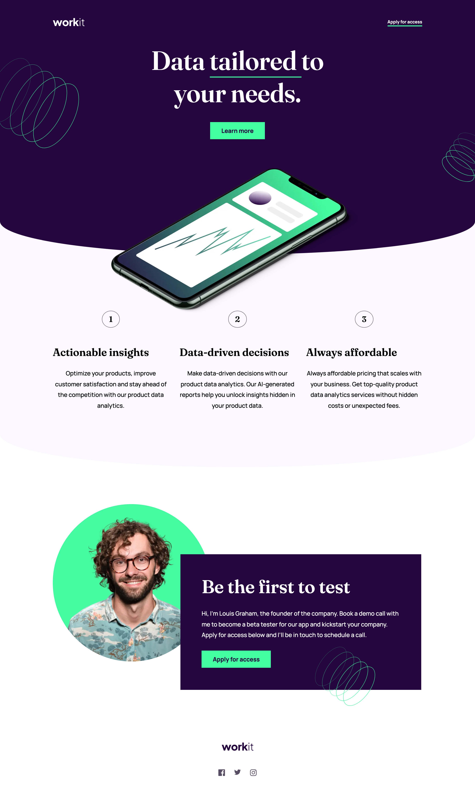

# Frontend Mentor - Workit landing page solution

This is a solution to the [Workit landing page challenge on Frontend Mentor](https://www.frontendmentor.io/challenges/workit-landing-page-2fYnyle5lu). Frontend Mentor challenges help you improve your coding skills by building realistic projects.

## Table of contents

- [Overview](#overview)
  - [The challenge](#the-challenge)
  - [Screenshot](#screenshot)
  - [Links](#links)
- [My process](#my-process)
  - [Built with](#built-with)
  - [What I learned](#what-i-learned)
  - [Continued development](#continued-development)
- [Author](#author)

## Overview

### The challenge

Users should be able to:

- View the optimal layout for the interface depending on their device's screen size
- See hover and focus states for all interactive elements on the page

### Screenshot

### Links

- Solution URL: [Frontend Mentor Solution ](https://www.frontendmentor.io/solutions/workit-landing-page-oKd4925G46)
- Live Site URL: [Live site at Netlify](https://glittery-meringue-10fadb.netlify.app/)

## My process

### Built with

- Semantic HTML5 markup
- CSS custom properties
- Flexbox
- CSS Grid

### What I learned

I used Claude Sonnet 3.5 to learn how to achieve the curved section borders using border-radius in CSS.

### Continued development

I would like to gain a better understanding of how to create curved section borders by watching more tutorial videos.

## Author

- Frontend Mentor - [@JGedd](https://www.frontendmentor.io/profile/JGedd)
